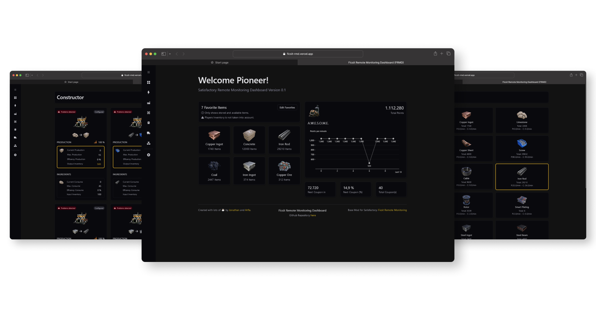
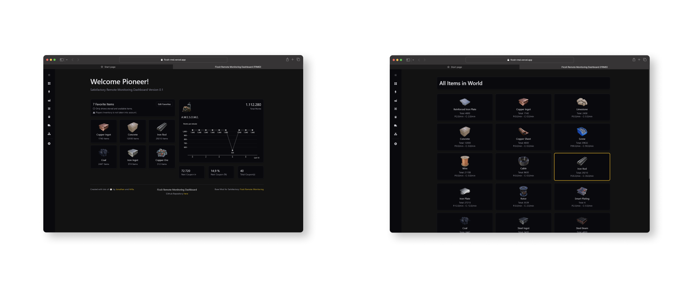
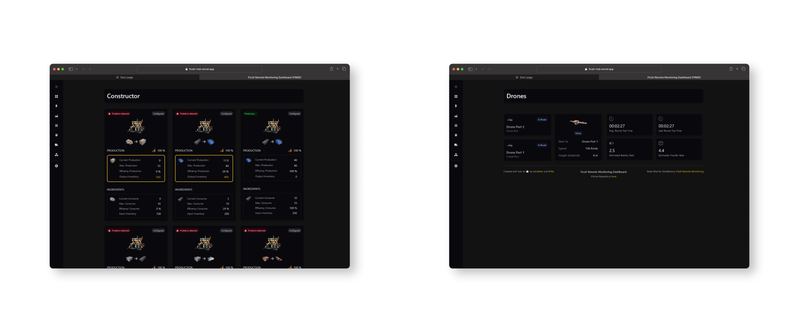

## ⚠ Information

The original authors of FRMD don't have that much time (at the moment) to further develop this dashboard.

So feel free to contribute to this project and enhance the features! Just make a pull request when you have something ready!

---

# Ficsit Remote Monitoring Dashboard [ FRMD ]

# How to use FRMD 
## Prequisites
You need to have the [Ficsit Remote Monitoring mod](https://ficsit.app/mod/FicsitRemoteMonitoring) by @porisius installed and running.
### Starting Ficsit Remote Monitoring in Satisfactory
To start the base-mod open the chat in game (with `ENTER`) and type in `/frm http start`.

## Using Ficsit Remote Monitoring Dashboard
Once the base mod is started, you can access our dashboard via https://ficsit-rmd.vercel.app/ or alternatively access the mod-included page at http://localhost:8080/. 

## Viewing the Dashboard via https://ficsit-rmd.vercel.app/
1. Start Satisfactory and run `/frm http start` in the chat
2. Open https://ficsit-rmd.vercel.app/ in a webbrowser.
2. Now you can see the data flying into the dashboard.

## Starting the Dashboard locally
### Prequisites
For running FRMD locally, you will need to have NodeJS 16.0+ installed on your system.

1. Pull this Repository and open it with f.ex. Visual Studio Code
2. Install all dependencies with `npm install` via a terminal
2. Start the Webserver with `npm start`
3. Access the Dashboard via http://localhost:3000/
4. Load into a savefile from Satisfactory and run `/frm http start` in the chat. 
5. Now you can see the data flying into the dashboard.

# Contributors
Thanks to all Contributors!
- Jonathan-Hofmann (Original Author)
- arfla (Original Author)
- tomatosauc (Active Contributor)
- LouisForaux (Active Contributor)
- Alexandre-RICHARD (Active Contributor)

# Gallery

Images of all managed items in the game stored into folders according to their category. Data located in `src\dictionnaries\gameItems.dictionnary`.

All images are in `256x256` pixels format, in `PNG` format. Exception for buildings in `512x512` format.  
The name of the images corresponds to the enum `GameItemsEnum` located `src\enums\gameItems.enum` in `Pascal_Snake_Case` format.
