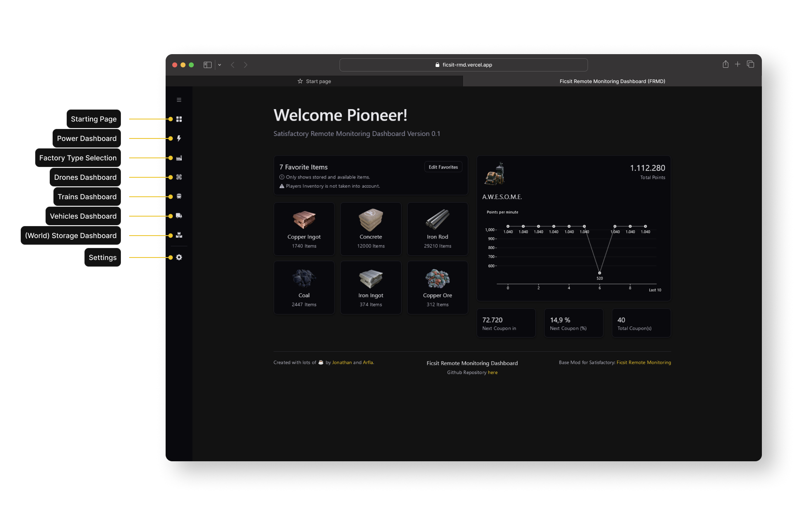

# Ficsit Remote Monitoring Dashboard [ FRMD ]

A nicely designed Dashboard for the Ficsit Remote Monitoring Mod. 

## Prequisites
You need to have the Ficsit Remote Monitoring mod by DarthPorisius installed and running.
### Starting Ficsit Remote Monitoring in Satisfactory
To start the base-mod open the chat (with `ENTER`) and type in `/frmweb start`.

## Using Ficsit Remote Monitoring Dashboard
One can either use the Dashboard via https://ficsit-rmd.vercel.app or run it locally.

### Running FRMD locally
#### Prequisites
For running FRMD locally, you will need to have NodeJS 16.0+ installed on your system.

1. Pull this Repository and open it with the terminal
2. Install all dependencies with `npm install`